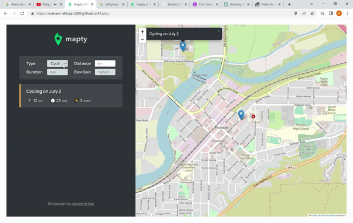

# Mapty

This application enables users to effortlessly track their cycling and running activities. By using Google Maps, users can simply click on any cycling or running event, and the application will seamlessly navigate them to the specific position on the map where the activity took place. This integration enhances the overall user experience and provides a visual representation of their routes. Notably, functional programming principles have been employed throughout the JavaScript codebase.


## Project GIF

<div class="gif-container" style="display: flex; justify-content: center; margin-left: auto; margin-right: auto;">
    
</div>

## 🚀 Demo

<a href="https://rahuldkjain.github.io/gh-profile-readme-generator" target="blank">

</a>

Try the application: https://maham-ishtiaq-2000.github.io/Mapty/


## 🛠️ Installation Steps

1. Clone the repository

```bash
git clone https://github.com/maham-ishtiaq-2000/Mapty.git
```

2. Change the working directory

```bash
cd Mapty.git
```

3. Install dependencies

```bash
npm install -y
npm install parser
```

4. Run the app

```bash
npx index.html
```

🌟 You are all set!

## 💻 Built with

- [HTML](https://www.gatsbyjs.com/) for structure
- [CSS](https://tailwindcss.com/) for styling
- [GoogleMaps] to access location
- [JavaScript](https://greensock.com/gsap/) for adding functionality
